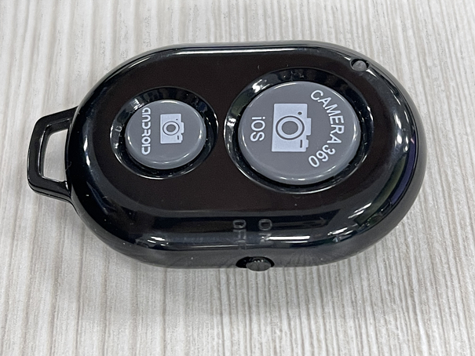
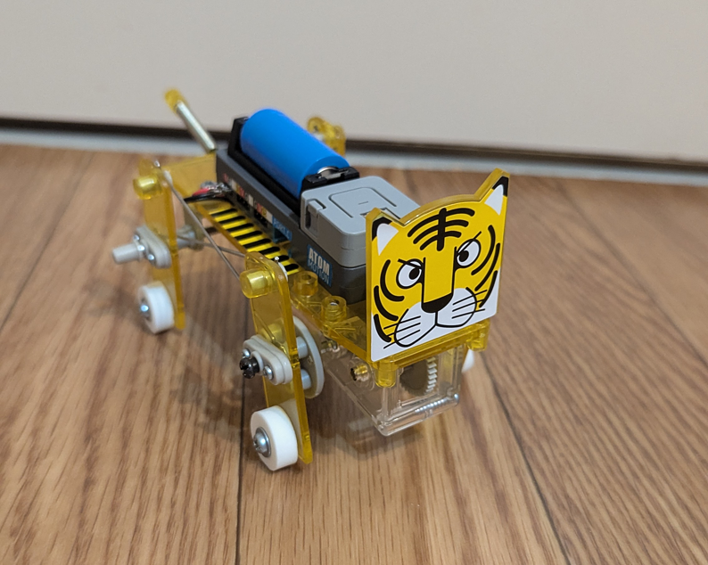

# M5Stack-AtomMotion-AtomLite-BLE-Control-sample

## 概要

M5StackのAtomicMotion（AtomLite付）をBluetoothで操作するサンプルです。

100均ショップなどで売っているBluetoothシャッターボタンで動作します。

image from https://techblog.gmo-ap.jp/2021/01/07/bluetoothbuttonshutter/

## 適用イメージ

タミヤのメカ・タイガーに乗せてみました。

## 利用ライブラリ

- m5stack/M5Unified
- m5stack/M5Atomic-Motion
- h2zero/NimBLE-Arduino
- fastled/FastLED

## 謝辞

AtomicMotionの制御は、M5Stack公式のサンプルコードから。

https://github.com/m5stack/M5AtomS3/blob/main/examples/AtomicBase/AtomicMotion/AtomicMotion.ino

Bluetooth制御は、H2zeroさんの記事のコードから利用させていただきました。

https://qiita.com/coppercele/items/4ce0e8858a92410c81e3

ありがとうございます。
